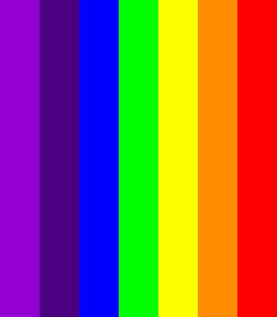
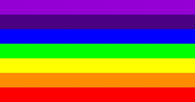
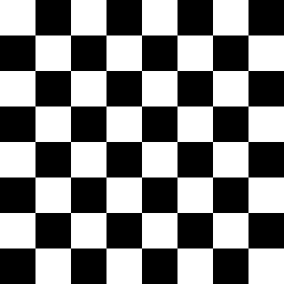
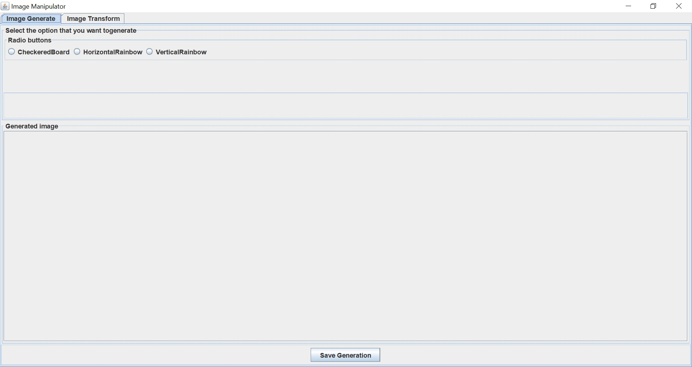
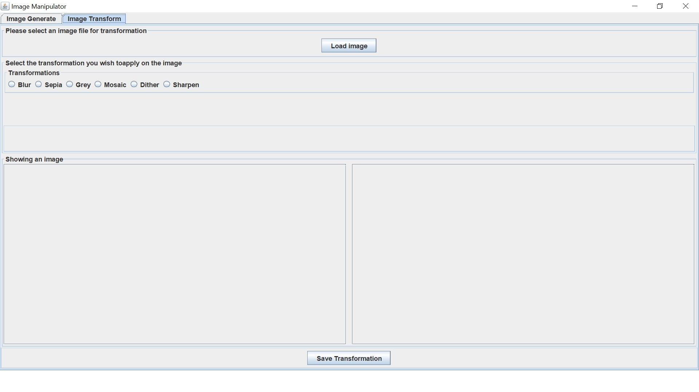
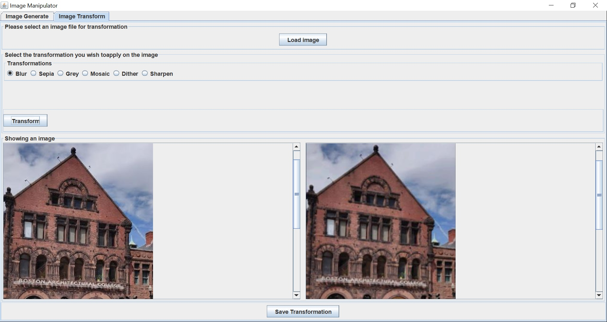
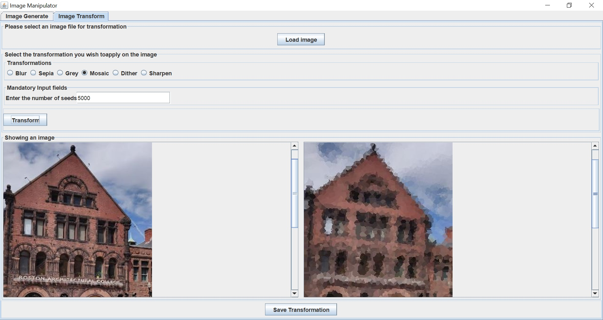
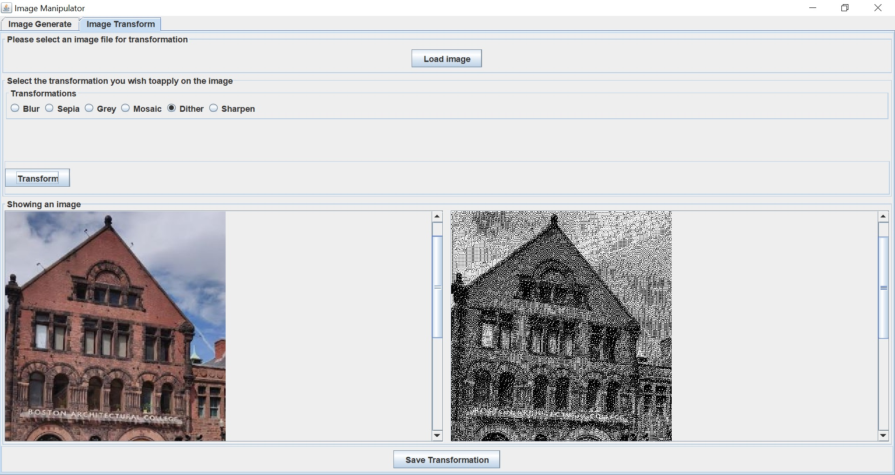
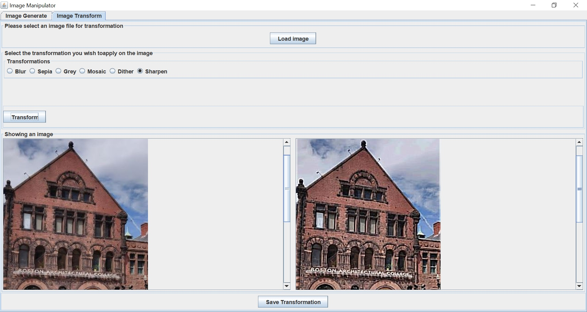

# ImageProcessingProject

### Introduction
  As part of curriculam for Programming design paradigm course in MSCS program at Northeastern University, I along with my project partner Anagha Bhosale developed an ImageProcessing application. 

The idea was to build an application that would allow user to generate images such as - Checkerboard, Vertical/Horizontal Rainbow, Country Flags, as well as process already generated images by applying several filters such as - Blur, Sepia, Greytone, Sharpen, Dither, Mosaic transform, etc.

### Implementation & operation at Glance
  The project is implemented as a standalone application using Java. The command design pattern has been used considering all the image generation & transformation operations as commands to the application. 
  
  There are primarily two operation modes of the application:
  * <ins>Batch operation mode using script</ins> - Here user would provide a script file including commands and all the relevant inputs to generate or transform the image.
  * <ins>Interactive operation mode using GUI</ins> - A graphical user interface supports all the image generation and transfomration operation, and users can select and perform operations of their desire using GUI. Result of the operation is immediately visible to the user on GUI.

The operation mode to be used can be selected while running the application. The command line argument can be passed such as "-script" or "-interactive" while executing the application, based on which application would start and operate. 

The <b>Image Generation</b> operations were implemented to accept user inputs in terms of height and/or width of the image to be generated. For instance, generating a checkerboard would require a box size (length of a side of a square in 8x8 checkerboard). Likewise, The vertical and horizontal rainbow generation requires height and width of the stripes. 

The <b>Image Transformation</b> operations would need user to load an image into the application on which transformations can be applied. Also, the user might need to provide additional input for transformation, such as number of seed points in Mosaic transformation.

Along with the generation and transformation operations, the application also supports Saving the results as image files.

### Operation Modes in detail

1. Script mode : The script mode can be invoked via command line by passing "-script" as command line argument. Along with "-script" a path of the script file as should be provides such as -
    -java -jar Program.jar -script path-of-script-file

The script file includes the operations to be performed as commands and relevant inputs for the opertion.
For exapmle following are the image generation commands, 
  VRainbow 50 400 
  Save VRainbow.jpg 
  HRainbow 400 30 
  Save HRainbow.jpg 
  CheckeredBoard 40 
  Save CB.jpg 
  
  Following are the resulting images:
  
  

  
   VRainbow.jpg
  

  
  

  
   HRainbow.jpg
  

  
  

  
   CB.jpg
  

  

2. Interactive Mode :

  

  
  

  
  

  
  

  

  
  

  

  
  

  
  

  
  

  
  

  
  

  
  

  
  

  
  

  
  

### Citations

All the images shows here are photographs taken by Ruchit Urunkar or results generated by code written by Ruchit Urunkar & Anagha Bhosale. Ruchit Urunkar and Anagha Bhosale retain the ownership and prohibit its use or modification.
